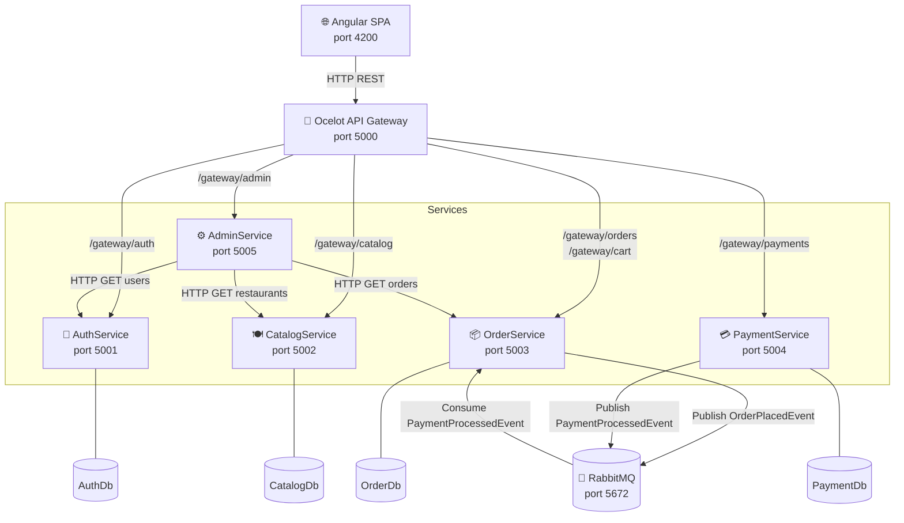
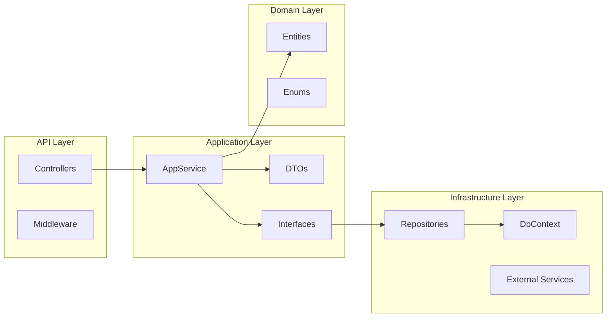
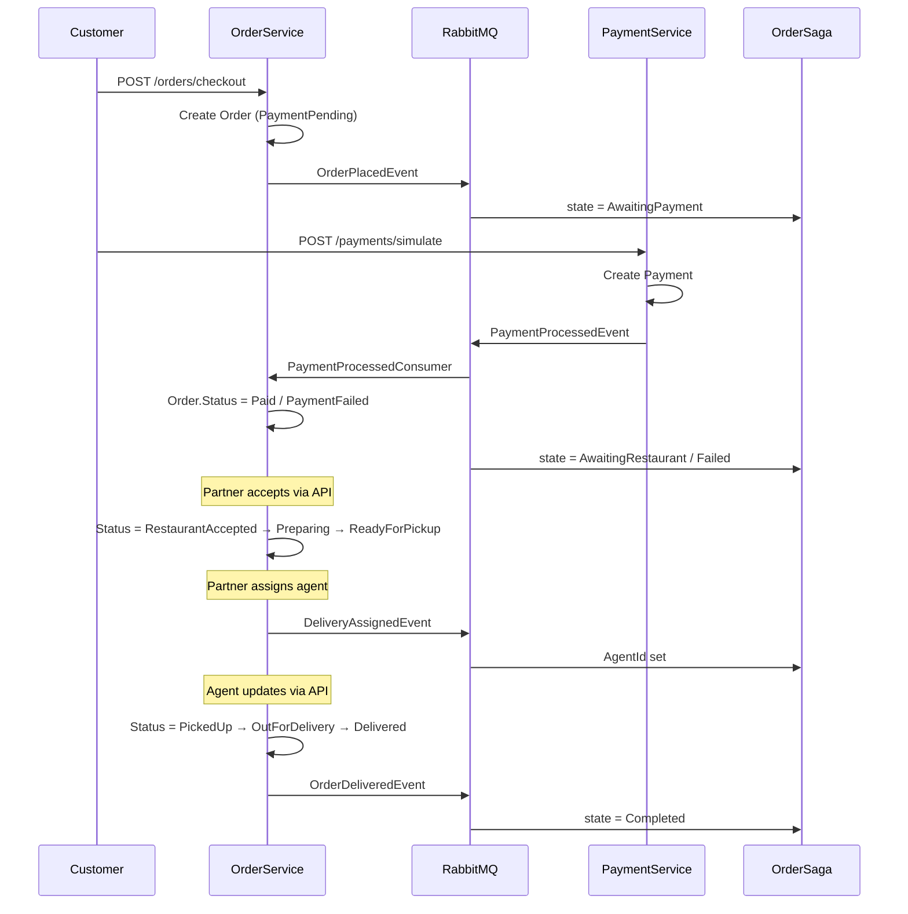

# Architecture Diagram — FoodDelivery

## High Level Design (HLD)

```mermaid
flowchart TD
    FE["🌐 Angular SPA\nport 4200"]
    GW["🔀 Ocelot API Gateway\nport 5000"]

    FE -->|HTTP REST| GW

    GW -->|/gateway/auth| AUTH
    GW -->|/gateway/catalog| CATALOG
    GW -->|/gateway/orders\n/gateway/cart| ORDER
    GW -->|/gateway/payments| PAYMENT
    GW -->|/gateway/admin| ADMIN

    subgraph Services
        AUTH["🔐 AuthService\nport 5001"]
        CATALOG["🍽️ CatalogService\nport 5002"]
        ORDER["📦 OrderService\nport 5003"]
        PAYMENT["💳 PaymentService\nport 5004"]
        ADMIN["⚙️ AdminService\nport 5005"]
    end

    ADMIN -->|HTTP GET orders| ORDER
    ADMIN -->|HTTP GET restaurants| CATALOG
    ADMIN -->|HTTP GET users| AUTH

    ORDER -->|Publish OrderPlacedEvent| MQ
    PAYMENT -->|Publish PaymentProcessedEvent| MQ
    MQ -->|Consume PaymentProcessedEvent| ORDER

    MQ[("🐇 RabbitMQ\nport 5672")]

    AUTH --- AUTHDB[("AuthDb")]
    CATALOG --- CATALOGDB[("CatalogDb")]
    ORDER --- ORDERDB[("OrderDb")]
    PAYMENT --- PAYMENTDB[("PaymentDb")]
```

---

## Clean Architecture — Per Service

```mermaid
flowchart LR
    subgraph API["API Layer"]
        C["Controllers"]
        M["Middleware"]
    end
    subgraph APP["Application Layer"]
        S["AppService"]
        D["DTOs"]
        I["Interfaces"]
    end
    subgraph DOMAIN["Domain Layer"]
        E["Entities"]
        EN["Enums"]
    end
    subgraph INFRA["Infrastructure Layer"]
        R["Repositories"]
        DB["DbContext"]
        EX["External Services"]
    end

    C --> S
    S --> I
    I --> R
    R --> DB
    S --> E
    S --> D
```

---

## Order Lifecycle — Event Flow

```mermaid
sequenceDiagram
    participant C as Customer
    participant OS as OrderService
    participant MQ as RabbitMQ
    participant PS as PaymentService
    participant Saga as OrderSaga

    C->>OS: POST /orders/checkout
    OS->>OS: Create Order (PaymentPending)
    OS->>MQ: OrderPlacedEvent
    MQ->>Saga: state = AwaitingPayment

    C->>PS: POST /payments/simulate
    PS->>PS: Create Payment
    PS->>MQ: PaymentProcessedEvent

    MQ->>OS: PaymentProcessedConsumer
    OS->>OS: Order.Status = Paid / PaymentFailed
    MQ->>Saga: state = AwaitingRestaurant / Failed

    Note over OS: Partner accepts via API
    OS->>OS: Status = RestaurantAccepted → Preparing → ReadyForPickup

    Note over OS: Partner assigns agent
    OS->>MQ: DeliveryAssignedEvent
    MQ->>Saga: AgentId set

    Note over OS: Agent updates via API
    OS->>OS: Status = PickedUp → OutForDelivery → Delivered
    OS->>MQ: OrderDeliveredEvent
    MQ->>Saga: state = Completed
```
