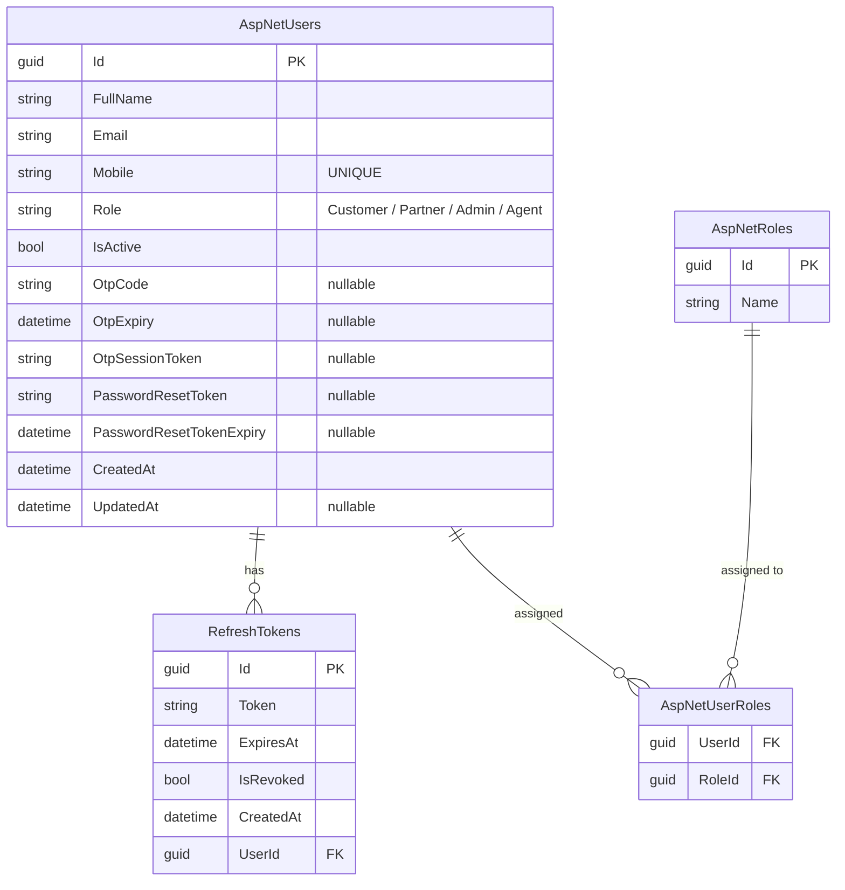
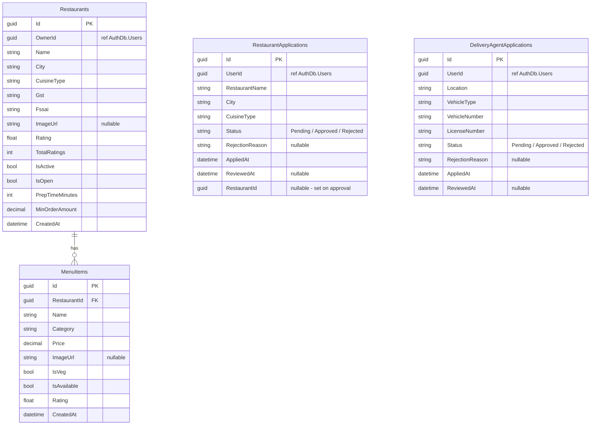
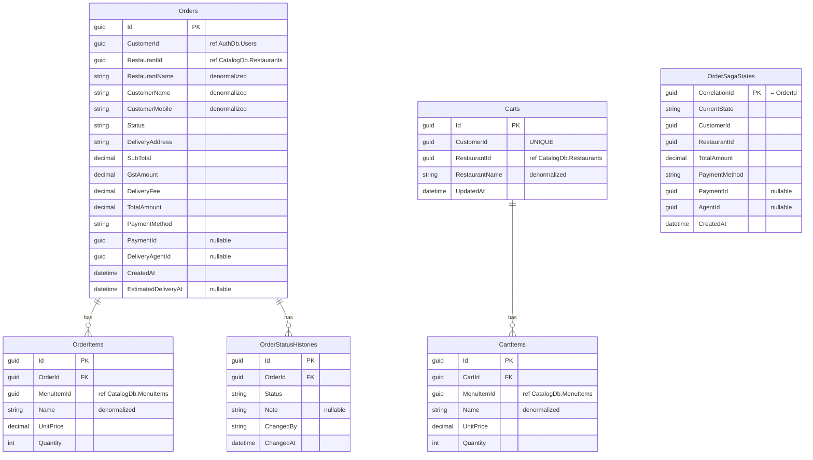
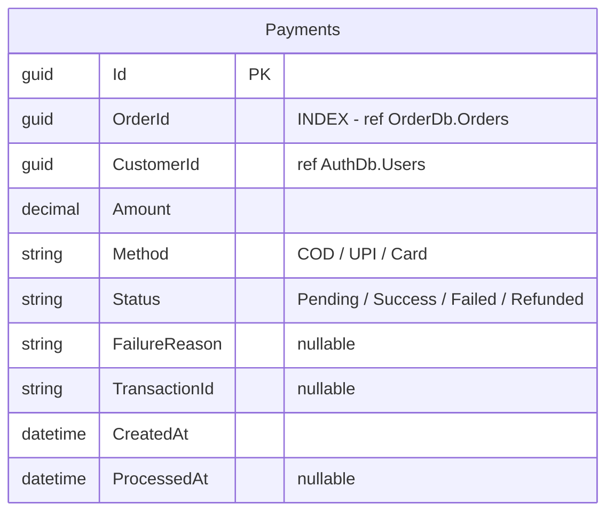
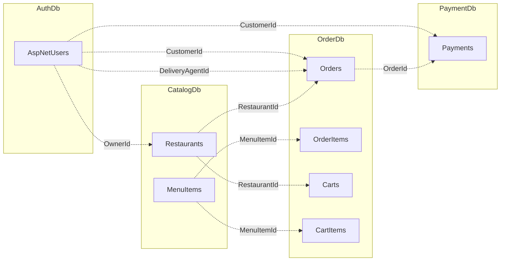

# Database Diagram — FoodDelivery

> 4 separate SQL Server databases. No cross-database FK constraints — only logical Guid references.

---

## AuthDb

---

## CatalogDb

---

## OrderDb

---

## PaymentDb

---

## Cross-Service References

