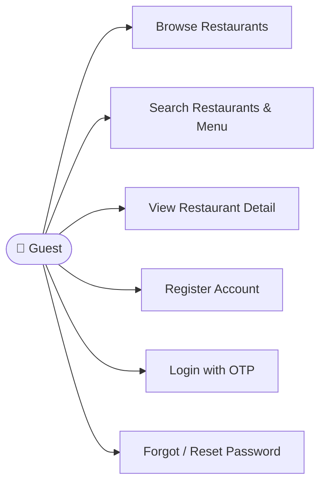
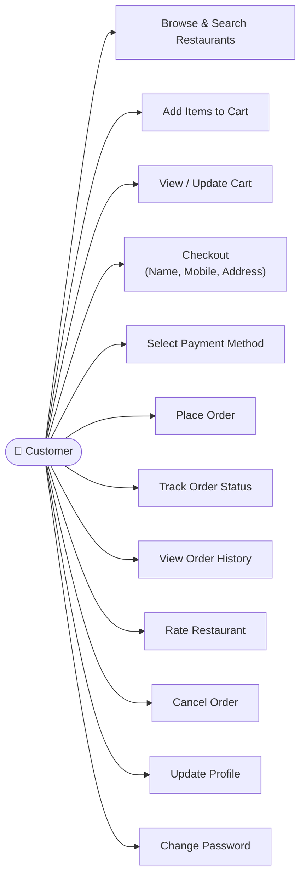
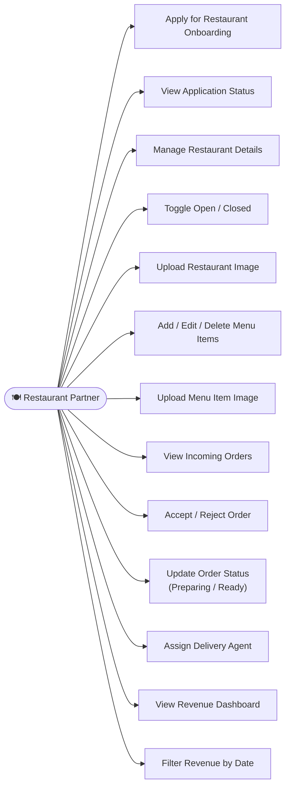
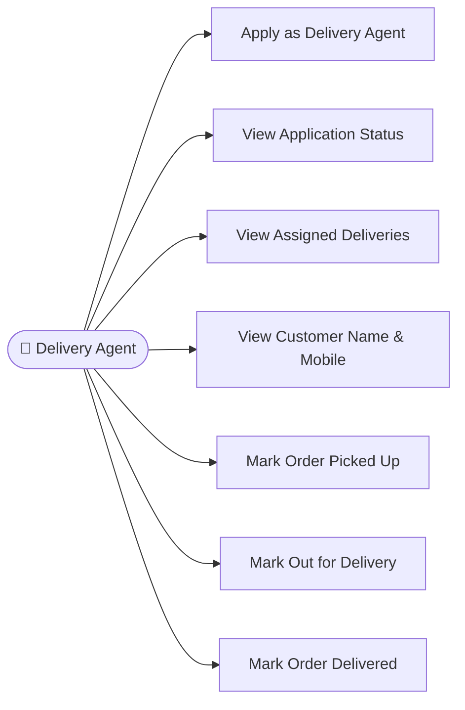
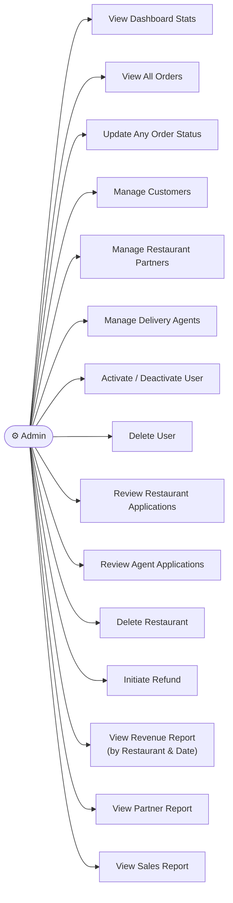

# Use Case Diagram — FoodDelivery

## Guest Use Cases

```mermaid
flowchart LR
    Guest(["👤 Guest"])
    Guest --> UC1["Browse Restaurants"]
    Guest --> UC2["Search Restaurants & Menu"]
    Guest --> UC3["View Restaurant Detail"]
    Guest --> UC4["Register Account"]
    Guest --> UC5["Login with OTP"]
    Guest --> UC6["Forgot / Reset Password"]
```

## Customer Use Cases

```mermaid
flowchart LR
    Customer(["🛒 Customer"])
    Customer --> UC1["Browse & Search Restaurants"]
    Customer --> UC2["Add Items to Cart"]
    Customer --> UC3["View / Update Cart"]
    Customer --> UC4["Checkout\n(Name, Mobile, Address)"]
    Customer --> UC5["Select Payment Method"]
    Customer --> UC6["Place Order"]
    Customer --> UC7["Track Order Status"]
    Customer --> UC8["View Order History"]
    Customer --> UC9["Rate Restaurant"]
    Customer --> UC10["Cancel Order"]
    Customer --> UC11["Update Profile"]
    Customer --> UC12["Change Password"]
```

## Restaurant Partner Use Cases

```mermaid
flowchart LR
    Partner(["🍽️ Restaurant Partner"])
    Partner --> UC1["Apply for Restaurant Onboarding"]
    Partner --> UC2["View Application Status"]
    Partner --> UC3["Manage Restaurant Details"]
    Partner --> UC4["Toggle Open / Closed"]
    Partner --> UC5["Upload Restaurant Image"]
    Partner --> UC6["Add / Edit / Delete Menu Items"]
    Partner --> UC7["Upload Menu Item Image"]
    Partner --> UC8["View Incoming Orders"]
    Partner --> UC9["Accept / Reject Order"]
    Partner --> UC10["Update Order Status\n(Preparing / Ready)"]
    Partner --> UC11["Assign Delivery Agent"]
    Partner --> UC12["View Revenue Dashboard"]
    Partner --> UC13["Filter Revenue by Date"]
```

## Delivery Agent Use Cases

```mermaid
flowchart LR
    Agent(["🛵 Delivery Agent"])
    Agent --> UC1["Apply as Delivery Agent"]
    Agent --> UC2["View Application Status"]
    Agent --> UC3["View Assigned Deliveries"]
    Agent --> UC4["View Customer Name & Mobile"]
    Agent --> UC5["Mark Order Picked Up"]
    Agent --> UC6["Mark Out for Delivery"]
    Agent --> UC7["Mark Order Delivered"]
```

## Admin Use Cases

```mermaid
flowchart LR
    Admin(["⚙️ Admin"])
    Admin --> UC1["View Dashboard Stats"]
    Admin --> UC2["View All Orders"]
    Admin --> UC3["Update Any Order Status"]
    Admin --> UC4["Manage Customers"]
    Admin --> UC5["Manage Restaurant Partners"]
    Admin --> UC6["Manage Delivery Agents"]
    Admin --> UC7["Activate / Deactivate User"]
    Admin --> UC8["Delete User"]
    Admin --> UC9["Review Restaurant Applications"]
    Admin --> UC10["Review Agent Applications"]
    Admin --> UC11["Delete Restaurant"]
    Admin --> UC12["Initiate Refund"]
    Admin --> UC13["View Revenue Report\n(by Restaurant & Date)"]
    Admin --> UC14["View Partner Report"]
    Admin --> UC15["View Sales Report"]
```
